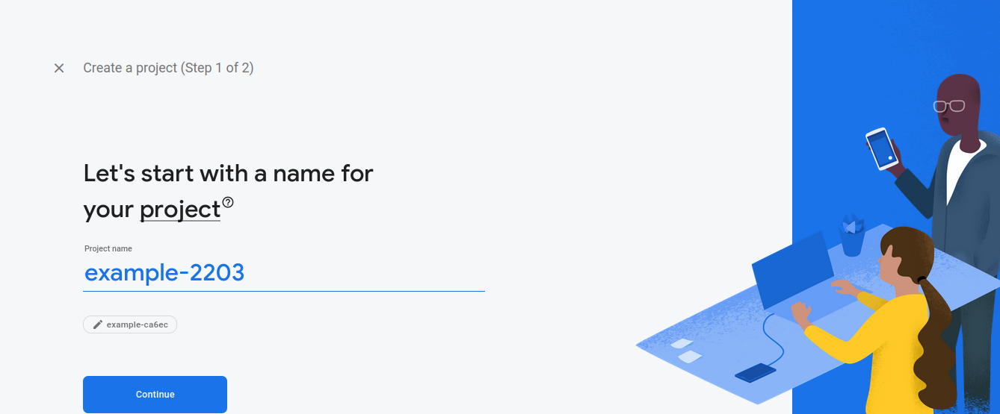

### Readme ionic with firebase database( type angular)
start dengan memulai project ionic 

```sh
ionic start firebase-ionic --type=angular --capacitor
```

## firebase
Masuk ke website firebase


Lalu pergi ke bagian console untuk membuat project


Tambah project 




Disable google analytics


Jika sudah create project lalu tunggu project firebase dibuat.


## Tampilan dashboard project firebase


jika sudah pilih bagian web untuk melihat membuat key dari web app yang dibuat


## Package
tambahkan angular fire dalam project ionic

```sh
ng add @angular/fire
```


## import module angular/fire
Import module @angular/fire pada app.module.ts

```typescript
    import { provideFirebaseApp, initializeApp } from '@angular/fire/app'
    import { getFirestore, provideFirestore } from '@angular/fire/firestore'
    
    provideFirebaseApp(() => initializeApp(environment.firebase)),
    provideFirestore(() => getFirestore())
```

### Tampilan UI
Tampilan awal


Tampilan tambah Note


Tampilan detail note


Tampilan delete note


### End-to-End testing menggunakan cypress
